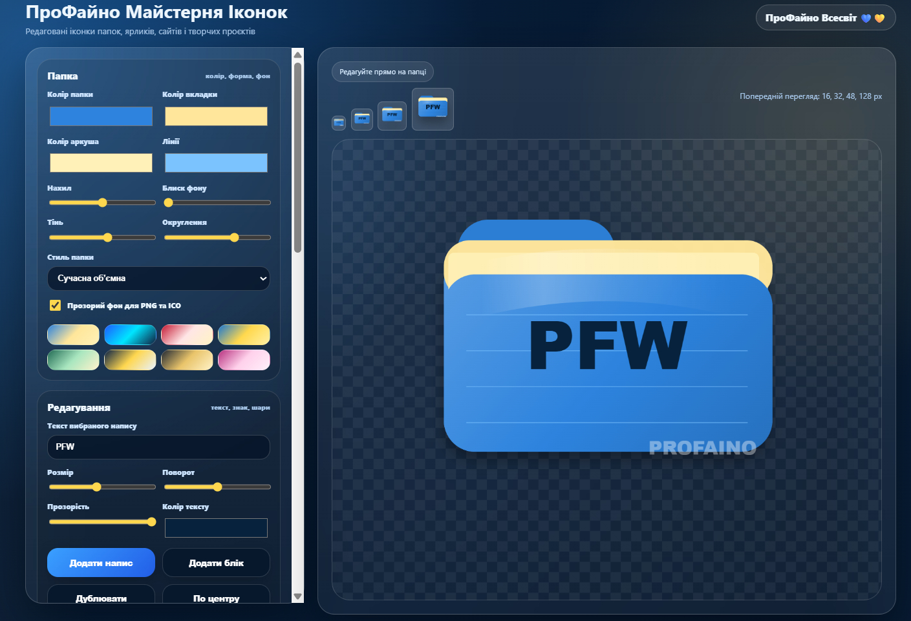

# ПроФайно Icon Studio 💛💙

**ПроФайно Icon Studio** — українська міні майстерня для створення стильних іконок папок, ярликів та PNG/ICO значків прямо в браузері.

Програма допомагає швидко оформити робочий стіл, папки, музичні проєкти, фото, відео, документи й особисті архіви без складного встановлення та зайвих програм.

## 🖼 Вигляд програми

## ✨ Що можна робити

- 📁 створювати сучасні іконки папок у різних стилях;
- 🎨 змінювати кольори, форму, фон і вигляд папки;
- 🔤 додавати текст, символи, emoji та власні зображення;
- 🖱 рухати елементи мишкою прямо на іконці;
- 🔄 змінювати розмір, нахил, прозорість і розташування;
- 👁 приховувати або прибирати зайві елементи;
- 🖼 експортувати готову іконку у PNG;
- 💻 створювати `.ico` для папок і ярликів Windows;
- 💾 зберігати дизайн як проєкт і відкривати його пізніше;
- 🚀 користуватися локально, без сервера, реєстрації та складного налаштування.

## ✅ Для чого підходить

- оформлення папок на робочому столі;
- створення іконок для ярликів Windows;
- музичні, фото та відеоархіви;
- документи, навчання, робота;
- творчі й медійні проєкти;
- український стиль для цифрового простору.

## 💻 Рекомендовані розміри для Windows

Для папок і ярликів Windows найкраще використовувати `.ico`, який містить кілька розмірів:

| Розмір | Для чого підходить |
|---|---|
| 16×16 | дрібні списки у Провіднику |
| 32×32 | стандартні ярлики |
| 48×48 | великі значки |
| 64×64 | комфортний проміжний розмір |
| 128×128 | якісні великі значки |
| 256×256 | високоякісні значки для великих екранів |

## 🚀 Як користуватися

### На комп’ютері

1. Натисніть кнопку **Code** на сторінці репозиторію.
2. Оберіть **Download ZIP**.
3. Розпакуйте архів на робочий стіл або в зручну папку.
4. Відкрийте файл `index.html` у браузері.
5. Створіть свою іконку.
6. Експортуйте результат у PNG або ICO.

## 📦 Що всередині

- `index.html` — головний файл програми;
- `assets` — зображення й додаткові матеріали;
- `docs` — інструкції та підказки;
- `examples` — приклади використання;
- `README.md` — опис проєкту;
- `LICENSE` — ліцензія.

## 🇺🇦 Про проєкт

**ПроФайно Icon Studio** створений у творчому просторі **ПроФайно Всесвіт** як простий і красивий інструмент для людей, які люблять порядок, стиль і український цифровий простір.

**ПроФайно Всесвіт**  
український контент без меж 💛💙

## 📄 Ліцензія

MIT License. Можна використовувати, змінювати й поширювати з посиланням на автора.
